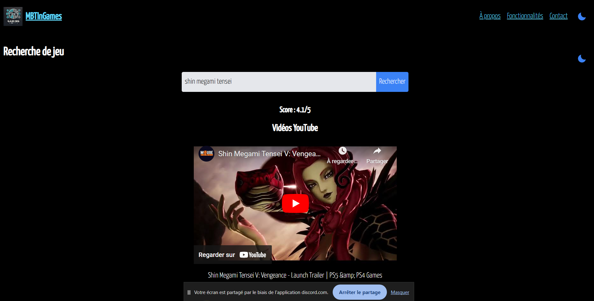
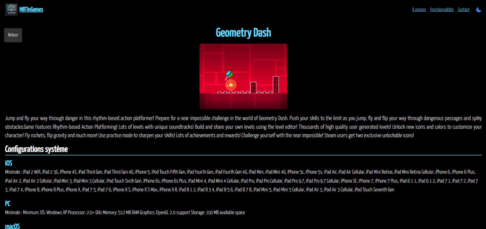
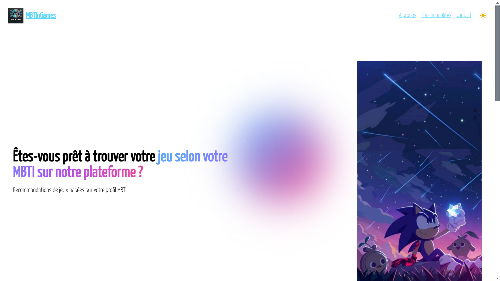
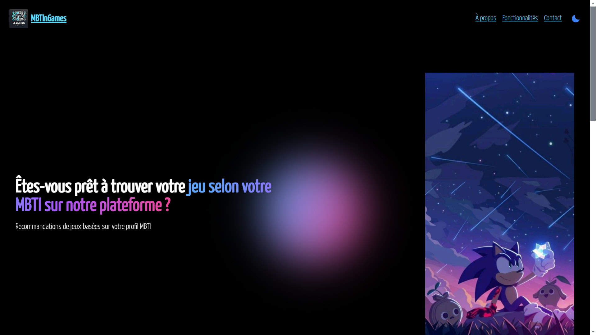
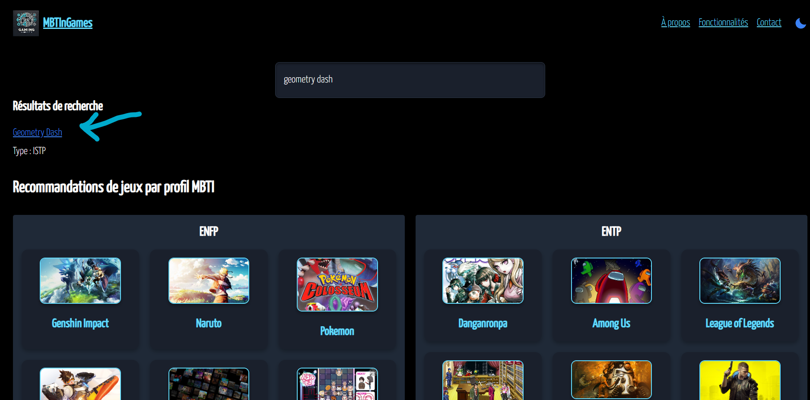

= MBT In Game

== Equipe :
****
- Chems-eddine HOUIDI
- Ephraim KABANGU
- Julien KA
- Jeff BALBERAN
****

== Objectifs de l'application :

L'objectif est d'aider un consommateur de jeux vidéo à mieux se repérer dans l'industrie en lui donnant des outils pour mieux cerner le marché

== V0.2 :

=== Voici nos 2 première grosses features :

****

 Recherche Youtube :

Permet de d'afficher les 3 plus grosse vidéo YouTube concernant le jeu.

Pour utiliser cette feature, vous devez cliquer dans la page Recherche Youtube. Dans cette page, vous verrez une barre de recherche en haut dans laquelle vous mettrez le nom d'un jeu. Ensuite, vous verrez les 3 vidéos Youtube les plus vues pour que vous vous fassiez une idée du jeu

Explications :

`YouTubeController.java` :
Ce fichier définit un contrôleur Spring Boot qui expose une API permettant de rechercher des vidéos YouTube. La méthode `searchVideos` reçoit un nom de jeu via un paramètre HTTP (`gameName`), utilise un service pour rechercher les vidéos associées, et renvoie les résultats sous forme d'une réponse HTTP JSON.

`VideoResult.java` :
Ce fichier représente les données principales des vidéos YouTube récupérées, avec deux champs : le titre (`title`) et l'URL de la vidéo (`videoUrl`). Il contient des constructeurs, ainsi que des getters et setters pour manipuler ces champs.

`YouTubeResponse.java` :
Ce fichier est une structure destinée à mapper les réponses JSON d'une API YouTube. Il inclut des classes imbriquées (`Item`, `Id`, `Snippet`) pour capturer les données des vidéos (comme `videoId` et `title`).

`YouTubeService.java` :
Contient la logique métier pour interagir avec l'API YouTube. Il construit une requête HTTP pour rechercher les 3 vidéos les plus pertinentes en utilisant la clé API et transforme la réponse en objets VideoResult.

En résumé, ce projet Spring Boot gère des requêtes de recherche YouTube via une API REST, extrait les résultats d'une API externe et les renvoie sous une forme simplifiée (`VideoResult.java`).

plantuml::model/digrammeYoutube.puml[svg]

****
****

 MBTI :

Permet de corréler le profil à son type de personnalité. Une fois cela fait il faudra décrire textuellement quel jeu sont adaptés à son profil MBTI

Pour utiliser ce programme, vous devez cliquer dans la page MBTI, vous pourrez voir les jeux conseillés pour chaque type de personnalité

Explications :

`GameMBTIScraper.java` : C'est un scraper web du site PDX (https://personality-index.com/) qui utilise Selenium pour extraire des informations depuis une page web et les sauvegarder dans un fichier CSV. Il ouvre un navigateur, attend que les données des jeux deviennent visibles, extrait le nom des jeux et leurs types MBTI à partir des blocs HTML, puis les écrit dans un fichier CSV nommé games_mbti.csv. Enfin, il ferme le navigateur.

`games_mbti.csv` : C'est ici que sont la base de données CSV que l'on a scraper

plantuml::model/digrammeMBTI.puml[svg]

****

== V0.3 :

=== Voici nos 2 nouvelles grosses features :

****

 Recherche note :

Une barre de recherche interroger l'API locale avec un nom de jeu. L'application transmet la demande à RAWG, récupère le score du jeu, et renvoie soit la note trouvée, soit un message d'erreur si le jeu est introuvable.

Pour l'utiliser il faut aller dans meme page que Recherche Youtube car il utilise aussi la barre de recherche

Explication :

`GameController.java` :
Ce contrôleur expose une API REST via `/api/game-score` et qui reçoit un paramètre `gameName`, interagit avec le service `RAWGService.java` pour obtenir la note du jeu, et retourne une réponse structurée (score ou erreur).

`RAWGService.java` :
Il communique avec l'API externe RAWG(https://rawg.io/) pour chercher des informations sur les jeux et construit une URL en incluant le nom du jeu (`gameName`) et une clé API, puis envoie une requête HTTP GET.

`RAWGResponse.java` :
Il sert à mapper la réponse JSON reçue de l'API RAWG, en extrayant les scores (`rating`) des résultats retournés.

`GameScoreResponse.java` :
Lorsqu'une note est trouvée, elle est encapsulée dans un objet structuré (`GameScoreResponse.java`) pour être envoyée en réponse HTTP.

plantuml::model/digrammeNote.puml[svg]

****
****

 Descriptif :

Ajout d'une section pour chaque jeu dans le menu MBTI avec la base de données RAWG, dans laquelle on peut voir une image de promotion, un descriptif, la configuration nécessaire et 2 bandes-annonces

Pour l'utiliser, vous dever cliquer sur un jeu dans la page MBTI, pour avoir des informations sur le jeu.

`GameInfo.js` :

Récupère des détails sur un jeu vidéo via l'API RAWG en utilisant le nom du jeu passé dans l'URL.
Affiche les informations sur le jeu (nom, image, description, configurations système).
Recherche et intègre les bandes-annonces du jeu via l'API YouTube.
Gère les erreurs et propose un bouton de retour à la page précédente.

`MBTIPage.js` :

Analyse un fichier CSV contenant des recommandations de jeux selon les types MBTI (grâce à PapaParse).
Regroupe les jeux par type MBTI et récupère leurs images via l'API RAWG.
Permet de rechercher des jeux par nom et d'afficher des résultats filtrés.
Affiche les jeux recommandés pour chaque type MBTI sous forme de cartes visuelles avec liens détaillés.
Les deux utilisent React Router pour naviguer entre les pages et gèrent l'affichage conditionnel en fonction des données chargées.

plantuml::model/digrammeGameInfo.puml[svg]

****

=== Voici nos 2 nouvelles petites features :

****

 Mode Claire / Sombre :

Ajout de 2 modes visuels, clair et sombre que l'on peut changer avec une icône en haut à droite

Pour basculer entre le mode clair et sombre, il suffit de cliquer sur l'icône en bas à droite avec la lune/soleil

`DarkMode.js` : Gere les modes sombre/clair. Il utilise useState pour suivre le thème (initialisé depuis localStorage) et useEffect pour appliquer les classes CSS correspondantes au document et sauvegarder le thème. Un bouton permet de basculer entre les modes, en affichant une icône dynamique (soleil ou lune) selon le thème actif.

****
****

 Recherche MBTI :

Ajout d'une barre de recherche pour une navigation rapide dans la section MBTI

Pour l'utiliser, il faut aller dans la page MBTI. Il y a une nouvelle barre de recherche pour chercher votre type de personnalité ou un jeu depuis la base de données RAWG

`Navbar.js` :

Ce composant de navigation comprend un logo, des liens vers différentes sections, et un bouton pour changer de thème (clair/sombre).
Le thème est sauvegardé dans le stockage local et appliqué automatiquement au chargement.
La navigation est stylisée et s'adapte au thème actif grâce à des classes dynamiques.
Le logo et les liens ajoutent une identité visuelle et permettent une navigation fluide.
Le composant utilise des icônes interactives pour basculer entre les modes clair et sombre.

****

=== Voici quelques améliorations :

****

- Amélioration du menu de choix de personnalité dans la section MBTI

